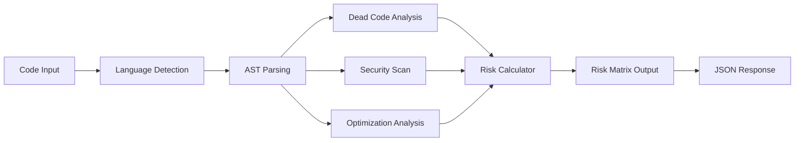

# Code Analysis Demo Tool - Master Plan

## Executive Summary

A lightweight, single-use demo tool that analyzes code snippets (Python, JavaScript, Java) and generates a Risk Matrix based on dead code detection, security vulnerabilities, and optimization opportunities. Built with Python/FastAPI, no persistent storage, designed for hackathon presentation.

---

## 1. Simplified Execution Flow



### Flow Description

1. **Input**: Receive code snippet via API or web UI
2. **Language Detection**: Auto-detect Python/JS/Java from syntax patterns
3. **AST Parsing**: Parse code into Abstract Syntax Tree
4. **Parallel Analysis**:
   - Dead Code Detection: Unused variables, unreachable code, obsolete imports
   - Security Scan: SQL injection patterns, XSS risks, hardcoded secrets
   - Optimization: Inefficient loops, redundant operations, complexity metrics
5. **Risk Calculation**: Map findings to severity/likelihood matrix
6. **Output**: Return structured JSON with Risk Matrix visualization data

---

## 2. Three-Step Development Roadmap

### Phase 1: Core Analysis Engine (Day 1 - 6 hours)
**Goal**: Build the analysis pipeline that processes code and detects issues

**Tasks**:
- Set up FastAPI project with virtual environment
- Implement multi-language AST parsers (Python: `ast`, JS: `esprima`, Java: `javalang`)
- Create dead code detector (unused vars, unreachable blocks)
- Build security pattern matcher (regex-based for speed)
- Implement basic optimization analyzer (cyclomatic complexity, loop efficiency)
- Unit test each analyzer with sample code

**Deliverable**: Working analysis engine that accepts code and returns findings

---

### Phase 2: Risk Matrix Generator (Day 2 - 4 hours)
**Goal**: Transform analysis findings into a structured Risk Matrix

**Tasks**:
- Define risk scoring algorithm (severity × likelihood)
- Map issue types to risk levels (Critical/High/Medium/Low)
- Implement Risk Matrix data structure
- Create JSON formatter for output
- Add visualization-ready data (coordinates, colors, labels)

**Deliverable**: Risk Matrix JSON output from analysis results

---

### Phase 3: API + Web UI (Day 2-3 - 6 hours)
**Goal**: Create demo-ready interface for presentation

**Tasks**:
- Build FastAPI endpoints (`/analyze`, `/health`)
- Create simple HTML/CSS/JS web interface
- Add code editor (CodeMirror or Monaco Editor)
- Implement Risk Matrix visualization (Chart.js or D3.js)
- Add example code snippets for quick testing
- Deploy locally with `uvicorn`

**Deliverable**: Full demo with API and web UI ready for presentation

---

## 3. Lightweight Libraries & Tools

### Python Backend
```python
# Core Framework
fastapi==0.104.1          # Modern, fast API framework
uvicorn==0.24.0           # ASGI server
pydantic==2.5.0           # Data validation

# Code Analysis
ast                       # Built-in Python AST parser
esprima==4.0.1           # JavaScript AST parser
javalang==0.13.0         # Java AST parser
radon==6.0.1             # Complexity metrics
bandit==1.7.5            # Security issue detector

# Utilities
python-multipart==0.0.6  # File upload support
```

### Frontend (Minimal)
```javascript
// Code Editor
CodeMirror 5.65.x        // Lightweight code editor

// Visualization
Chart.js 4.x             // Simple charting library

// Styling
Tailwind CSS (CDN)       // Utility-first CSS
```

### Why These Libraries?

- **FastAPI**: Fastest Python framework, auto-generates API docs
- **ast (built-in)**: No dependencies, perfect for Python analysis
- **esprima**: Lightweight JS parser, 100% standards-compliant
- **javalang**: Pure Python Java parser, no JVM required
- **radon**: Quick complexity metrics (cyclomatic, maintainability)
- **bandit**: Industry-standard security linter for Python
- **CodeMirror**: Lightweight, syntax highlighting, easy integration
- **Chart.js**: Simple API, good for scatter plots (Risk Matrix)

---

## 4. Risk Matrix Output Structure

### JSON Response Format

```json
{
  "analysis_id": "uuid-v4-string",
  "timestamp": "2026-05-17T02:20:00Z",
  "language": "python",
  "code_metrics": {
    "lines_of_code": 150,
    "cyclomatic_complexity": 12,
    "maintainability_index": 65.4
  },
  "findings": {
    "dead_code": [
      {
        "type": "unused_variable",
        "line": 23,
        "code": "unused_var = calculate_something()",
        "message": "Variable 'unused_var' is assigned but never used",
        "severity": "low",
        "likelihood": "high"
      },
      {
        "type": "unreachable_code",
        "line": 45,
        "code": "return result",
        "message": "Code after return statement is unreachable",
        "severity": "medium",
        "likelihood": "high"
      }
    ],
    "security_issues": [
      {
        "type": "sql_injection",
        "line": 67,
        "code": "query = f\"SELECT * FROM users WHERE id={user_id}\"",
        "message": "Potential SQL injection vulnerability",
        "severity": "critical",
        "likelihood": "medium",
        "cwe": "CWE-89"
      },
      {
        "type": "hardcoded_secret",
        "line": 12,
        "code": "API_KEY = 'sk-1234567890abcdef'",
        "message": "Hardcoded API key detected",
        "severity": "high",
        "likelihood": "high"
      }
    ],
    "optimizations": [
      {
        "type": "inefficient_loop",
        "line": 89,
        "code": "for i in range(len(items)):",
        "message": "Use 'for item in items:' instead of indexing",
        "severity": "low",
        "likelihood": "low",
        "impact": "performance"
      },
      {
        "type": "redundant_operation",
        "line": 102,
        "code": "result = str(str(value))",
        "message": "Redundant string conversion",
        "severity": "low",
        "likelihood": "medium"
      }
    ]
  },
  "risk_matrix": {
    "summary": {
      "critical": 1,
      "high": 2,
      "medium": 3,
      "low": 4,
      "total_issues": 10
    },
    "risk_score": 7.8,
    "risk_level": "HIGH",
    "matrix_data": [
      {
        "id": "finding-1",
        "title": "SQL Injection Vulnerability",
        "severity": 5,
        "likelihood": 3,
        "risk_score": 15,
        "category": "security",
        "color": "#dc2626"
      },
      {
        "id": "finding-2",
        "title": "Hardcoded API Key",
        "severity": 4,
        "likelihood": 5,
        "risk_score": 20,
        "category": "security",
        "color": "#dc2626"
      },
      {
        "id": "finding-3",
        "title": "Unreachable Code Block",
        "severity": 3,
        "likelihood": 5,
        "risk_score": 15,
        "category": "dead_code",
        "color": "#f59e0b"
      },
      {
        "id": "finding-4",
        "title": "Unused Variable",
        "severity": 2,
        "likelihood": 5,
        "risk_score": 10,
        "category": "dead_code",
        "color": "#10b981"
      }
    ],
    "visualization": {
      "chart_type": "scatter",
      "x_axis": "Likelihood (1-5)",
      "y_axis": "Severity (1-5)",
      "zones": {
        "critical": {"min_score": 16, "color": "#dc2626"},
        "high": {"min_score": 12, "color": "#f59e0b"},
        "medium": {"min_score": 6, "color": "#fbbf24"},
        "low": {"min_score": 0, "color": "#10b981"}
      }
    }
  },
  "recommendations": [
    "Address 1 critical security issue immediately",
    "Refactor 2 high-risk areas before production",
    "Consider optimizing 4 low-priority items for maintainability"
  ]
}
```

### Risk Matrix Visualization

The matrix data maps to a 5×5 grid:

```
Severity
   5 │ 🟢  🟡  🟡  🟠  🔴
   4 │ 🟢  🟡  🟠  🟠  🔴
   3 │ 🟢  🟡  🟠  🔴  🔴
   2 │ 🟢  🟢  🟡  🟠  🔴
   1 │ 🟢  🟢  🟢  🟡  🟠
     └─────────────────────
       1   2   3   4   5  Likelihood

🟢 Low Risk (1-5)
🟡 Medium Risk (6-11)
🟠 High Risk (12-15)
🔴 Critical Risk (16-25)
```

---

## 5. Project Structure

```
code-analysis-demo/
├── app/
│   ├── __init__.py
│   ├── main.py                 # FastAPI app entry point
│   ├── models.py               # Pydantic models
│   ├── analyzers/
│   │   ├── __init__.py
│   │   ├── base.py            # Base analyzer class
│   │   ├── dead_code.py       # Dead code detector
│   │   ├── security.py        # Security scanner
│   │   ├── optimization.py    # Optimization analyzer
│   │   └── language_parser.py # Multi-language AST parser
│   ├── risk/
│   │   ├── __init__.py
│   │   ├── calculator.py      # Risk scoring logic
│   │   └── matrix.py          # Risk matrix generator
│   └── utils/
│       ├── __init__.py
│       └── language_detect.py # Language detection
├── static/
│   ├── index.html             # Web UI
│   ├── style.css              # Styling
│   └── app.js                 # Frontend logic
├── tests/
│   ├── test_analyzers.py
│   ├── test_risk.py
│   └── sample_code/           # Test snippets
│       ├── sample.py
│       ├── sample.js
│       └── sample.java
├── requirements.txt
├── README.md
└── run.sh                     # Quick start script
```

---

## 6. API Endpoints

### POST `/analyze`
Analyze code snippet and return Risk Matrix

**Request**:
```json
{
  "code": "def unused_function():\n    pass\n\nresult = 42",
  "language": "python"  // optional, auto-detected if omitted
}
```

**Response**: Full Risk Matrix JSON (see section 4)

---

### GET `/health`
Health check endpoint

**Response**:
```json
{
  "status": "healthy",
  "version": "1.0.0",
  "supported_languages": ["python", "javascript", "java"]
}
```

---

## 7. Quick Start Commands

```bash
# Setup
python -m venv venv
source venv/bin/activate  # Windows: venv\Scripts\activate
pip install -r requirements.txt

# Run
uvicorn app.main:app --reload --port 8000

# Test API
curl -X POST http://localhost:8000/analyze \
  -H "Content-Type: application/json" \
  -d '{"code": "x = 1\ny = 2", "language": "python"}'

# Access Web UI
open http://localhost:8000
```

---

## 8. Demo Presentation Flow

1. **Introduction** (1 min)
   - Problem: Code quality issues lead to security risks and technical debt
   - Solution: Automated analysis with visual Risk Matrix

2. **Live Demo** (3 min)
   - Open web UI
   - Paste sample code with intentional issues
   - Click "Analyze"
   - Show Risk Matrix visualization
   - Highlight critical findings

3. **Technical Deep Dive** (2 min)
   - Show API endpoint with curl
   - Explain multi-language support
   - Demonstrate JSON output structure

4. **Use Cases** (1 min)
   - Pre-commit hooks
   - CI/CD integration
   - Code review automation
   - Security audits

---

## 9. Success Metrics

- ✅ Analyzes code in <2 seconds
- ✅ Detects 3+ types of issues per category
- ✅ Supports 3 languages (Python, JS, Java)
- ✅ Generates accurate Risk Matrix
- ✅ Clean, demo-ready web interface
- ✅ Zero infrastructure dependencies

---

## 10. Future Enhancements (Post-Hackathon)

- Add more languages (Go, Rust, C++)
- Machine learning for smarter pattern detection
- Integration with GitHub/GitLab APIs
- Historical trend analysis
- Team collaboration features
- Custom rule configuration

---

## Timeline Summary

| Phase | Duration | Deliverable |
|-------|----------|-------------|
| Phase 1: Core Engine | 6 hours | Working analyzers |
| Phase 2: Risk Matrix | 4 hours | JSON output format |
| Phase 3: API + UI | 6 hours | Demo-ready tool |
| **Total** | **16 hours** | **Complete POC** |

---

## Key Design Decisions

1. **No Database**: All processing in-memory, stateless
2. **Multi-language**: Broader appeal, more impressive demo
3. **FastAPI**: Modern, fast, auto-documented
4. **Lightweight Parsers**: No heavy dependencies, quick setup
5. **Visual Risk Matrix**: Clear, executive-friendly output
6. **Single-file Analysis**: Simplifies scope, faster demo

---

## Risk Mitigation

| Risk | Mitigation |
|------|------------|
| Parser failures | Graceful error handling, fallback to regex |
| Performance issues | Limit code size to 1000 lines |
| Language detection errors | Allow manual language specification |
| Complex Java parsing | Focus on common patterns, not full coverage |
| Time constraints | Prioritize Python analysis, add others if time permits |

---

## Conclusion

This plan delivers a functional, impressive demo in 16 hours. The tool is lightweight, fast, and visually compelling with the Risk Matrix output. By focusing on core functionality and avoiding infrastructure complexity, we maximize demo impact while staying within hackathon constraints.

**Next Step**: Review this plan, make any adjustments, then switch to Code mode to begin implementation.